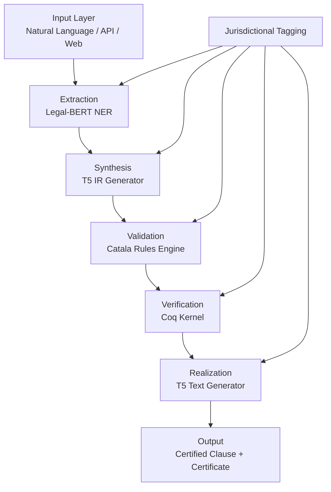

# Coq-Certified Legal AI: Roadmap and Product Specifications

## Introduction

This document outlines the phased roadmap and detailed product specifications for the Coq-Certified Legal AI product, a sophisticated tool designed to enhance legal drafting and verification processes by providing mathematically guaranteed determinacy for legal clauses. The product leverages formal verification techniques to ensure that generated clauses maintain consistent court-outcome invariance under specified legal frameworks, reducing ambiguity in legal documents and increasing confidence in legal interpretations.

The roadmap synthesizes all completed work, including the product scope, research summary, Normative Intermediate Representation (IR) and Court Outcome Surface design, Coq kernel implementation, neural components, certificate pipeline, and regression suite. It progresses from the current prototype state to a full production-ready product, with estimated milestones, timelines, and deliverables.

The product specifications detail functional features, non-functional requirements, and technical architecture, serving as the definitive guide for development and deployment.

## Roadmap Phases

### Phase 1: Prototype Completion (Current State - Q1 2026)

**Objective:** Finalize and validate the core prototype demonstrating Coq-certified legal AI capabilities.

**Milestones:**
- Complete Coq kernel with formal proofs of invariance
- Integrate neural extractors and synthesizers
- Establish certificate pipeline for IR verification
- Implement basic regression tests

**Timelines:**
- Start: January 2026
- End: March 2026 (3 months)

**Deliverables:**
- Functional Coq kernel (NormativeIR.v, CourtOutcome.v, Evaluator.v, Invariance.v)
- Neural components: Legal-BERT extractor, T5-based IR synthesizer and realizer
- Catala integration for rule validation
- Certificate generation and verification scripts
- Initial test suite (integration, certificate reusability)

**Current Status:** Completed as of January 2026. Core components implemented with basic Coq proofs and neural pipelines operational.

### Phase 2: Minimum Viable Product (MVP) - Q2 2026

**Objective:** Create an integrated MVP that demonstrates end-to-end functionality from input text to certified output.

**Milestones:**
- Develop unified pipeline integrating all components
- Build basic web interface for user interaction
- Expand test coverage to include more legal scenarios
- Fine-tune neural models on legal datasets

**Timelines:**
- Start: April 2026
- End: June 2026 (3 months)

**Deliverables:**
- End-to-end pipeline script
- Simple web UI (input text, get certified clause/output)
- Expanded Coq theorems for multiple atom types
- Improved neural models with better accuracy
- Comprehensive test suite with 80%+ coverage

### Phase 3: Beta Release - Q3-Q4 2026

**Objective:** Prepare for beta testing with expanded jurisdictions, improved performance, and user feedback integration.

**Milestones:**
- Add support for multiple jurisdictions (US states, EU countries)
- Optimize neural models for production performance
- Implement API for programmatic access
- Conduct alpha testing with legal professionals

**Timelines:**
- Start: July 2026
- End: December 2026 (6 months)

**Deliverables:**
- Jurisdiction-specific IR extensions
- Optimized inference pipeline (<500ms response time)
- REST API documentation and implementation
- Beta UI with advanced features (bulk processing, export options)
- User feedback integration and bug fixes

### Phase 4: Production Release - Q1-Q2 2027

**Objective:** Launch full production product with enterprise features, scalability, and compliance certifications.

**Milestones:**
- Achieve SOC 2 compliance for data security
- Scale to handle high-volume requests
- Add advanced features (multi-language support, integration with legal databases)
- Launch marketing and sales campaigns

**Timelines:**
- Start: January 2027
- End: June 2027 (6 months)

**Deliverables:**
- Production deployment on cloud infrastructure
- Scalable architecture handling 1000+ requests/minute
- Enterprise features: audit logging, role-based access
- Full documentation suite (user guides, API docs, admin manuals)
- Marketing materials and go-to-market strategy

### Phase 5: Post-Launch Enhancements (Ongoing - 2027+)

**Objective:** Continuously improve the product based on user adoption and technological advancements.

**Milestones:**
- Quarterly feature releases
- Annual major updates with new capabilities
- Community-driven improvements

**Timelines:** Ongoing from Q3 2027

**Deliverables:** Regular updates, feature enhancements, community contributions.

## Product Specifications

### Functional Requirements

#### Core Features
1. **Legal Text Input Processing**
   - Accept natural language legal text descriptions
   - Support structured inputs (JSON, XML) via API
   - Handle multiple input formats with automatic detection

2. **Normative IR Generation**
   - Extract legal norms from input text using neural extractors
   - Generate typed IR conforming to schema with enums and constraints
   - Validate IR against Catala rules for semantic correctness

3. **Formal Verification**
   - Generate Coq code from IR for proof checking
   - Verify court-outcome invariance across paraphrases
   - Provide mathematical guarantees for clause determinacy

4. **Output Generation**
   - Realize verified IR back to natural language clauses
   - Support multiple output formats (text, structured data)
   - Include certificates proving invariance guarantees

5. **Jurisdictional Support**
   - Tag inputs and outputs with jurisdiction identifiers
   - Apply jurisdiction-specific rules and doctrines
   - Modular architecture for easy extension to new jurisdictions

#### Advanced Features
- Bulk processing for multiple clauses
- Integration with legal research databases
- Export to common legal document formats
- Real-time validation feedback during drafting

### Non-Functional Requirements

#### Performance
- Response time: <2 seconds for single clause processing
- Throughput: Support 100 concurrent users in beta, 1000+ in production
- Scalability: Horizontal scaling via containerization (Docker/K8s)

#### Reliability
- Uptime: 99.9% availability
- Error handling: Graceful degradation with clear error messages
- Data integrity: All operations logged and auditable

#### Security
- Encryption: End-to-end encryption for data in transit and at rest
- Access control: Role-based permissions (lawyer, admin, integrator)
- Compliance: GDPR, CCPA compliance for data handling

#### Usability
- Interface: Intuitive web UI with drag-and-drop file upload
- Accessibility: WCAG 2.1 AA compliance
- Localization: Support for English initially, extensible to other languages

### Technical Specifications

#### Architecture Overview

The system follows a sequential pipeline architecture:

#### Key Components

1. **Normative IR Schema**
   - Typed JSON structure with required fields
   - Enums: modality (MUST, MUST_NOT, MAY, SHOULD), trigger (AWARENESS, DISCOVERY, OCCURRENCE)
   - Evidence pointers for auditability

2. **Court Outcome Surface**
   - Minimal findings: obligation_exists, breach, liability, remedies, defenses
   - Boolean and enum types for deterministic evaluation

3. **Coq Kernel**
   - Inductive types mirroring IR schema
   - Evaluator function: IR + Scenario → Outcome
   - Invariance theorems proving equivalent IRs yield same outcomes

4. **Neural Components**
   - Legal-BERT: Fine-tuned for legal NER (parties, obligations, conditions)
   - IR Synthesizer: T5 model with constrained decoding for valid JSON
   - Realizer: Template-based and model-based text generation

5. **Certificate Pipeline**
   - Coq interface: Generate proofs and run coqc
   - Certificate packaging: JSON format with IR and proof data
   - Verification: Check certificate validity and reusability

#### Technologies
- **Backend:** Python (FastAPI), Coq, OCaml (Catala)
- **AI/ML:** HuggingFace Transformers (BERT, T5)
- **Frontend:** React.js for web interface
- **Infrastructure:** Docker, Kubernetes, AWS/GCP
- **Database:** PostgreSQL for metadata, Redis for caching

#### Data Flow
1. Input text → Neural extraction → Entities
2. Entities → IR synthesis → Normative IR JSON
3. IR → Catala validation → Validated IR
4. IR → Coq certification → Certified IR
5. Certified IR → Text realization → Output clause + certificate

#### Integration Points
- Catala: Rule validation and outcome computation
- Coq: Formal verification proofs
- External APIs: Legal databases, court records (future)

## Conclusion

The Coq-Certified Legal AI product represents a groundbreaking approach to legal technology, combining AI with formal methods to provide unprecedented guarantees of clause determinacy and court-outcome invariance. The phased roadmap ensures methodical progression from prototype to production, with clear milestones and deliverables to guide development.

The comprehensive specifications outlined here provide the technical foundation for implementation, ensuring the product meets the needs of legal professionals while maintaining the highest standards of reliability, security, and formal correctness. This document serves as the roadmap and blueprint for delivering a transformative tool in the legal domain.