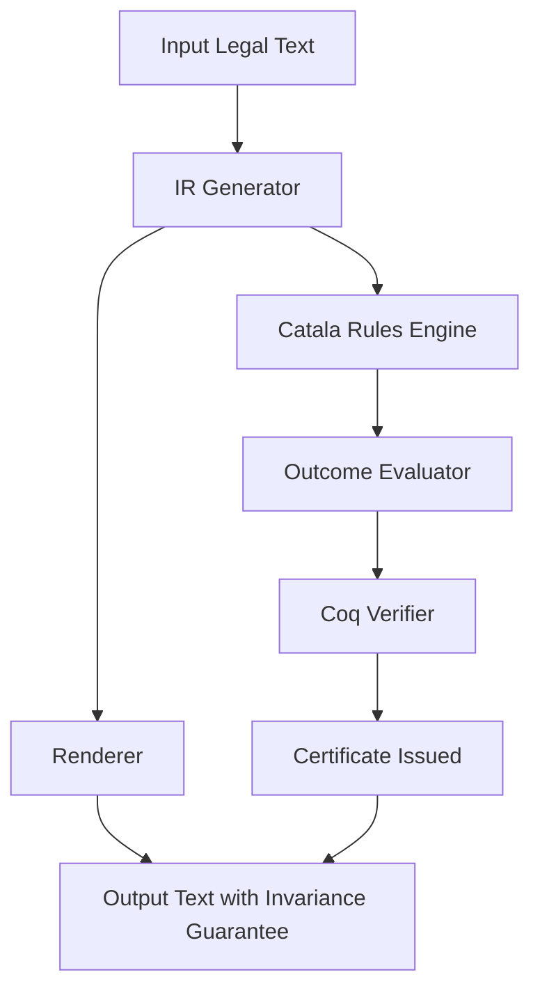

# Design of Normative IR and Court Outcome Surface for Coq-Certified Legal AI

## Overview

This document outlines the design of the Normative Intermediate Representation (IR) and the Court Outcome Surface for a Coq-Certified Legal AI system. The design ensures court-outcome invariance by formalizing legal norms in a typed structure and defining minimal judicial findings that remain deterministic under specified legal frameworks. The design integrates with Catala for rule-based legal logic and supports Coq certification for formal proof of invariance.

## Normative IR Schema

The Normative IR represents legal norms as a structured, typed intermediate representation. It is designed to prevent unrepresentable invalid meanings by using enums, required fields, and typed structures, ensuring that only well-formed legal semantics can be expressed.

### Schema Definition (JSON-like)

```json
{
  "atoms": [
    {
      "id": "string (UUID)",
      "actor": "string (entity name, e.g., Vendor)",
      "modality": "enum {MUST, MUST_NOT, MAY, SHOULD}",
      "action": "string (normalized verb, e.g., NOTIFY)",
      "object": "string (what action applies to, e.g., SECURITY_INCIDENT)",
      "recipient": "string (who benefits, e.g., Customer)",
      "trigger": "enum {AWARENESS, DISCOVERY, OCCURRENCE}",
      "deadline": {
        "type": "DURATION",
        "hours": "number"
      } | {
        "type": "FIXED",
        "date": "string"
      },
      "exceptions": ["enum {UNLESS_PROHIBITED_BY_LAW, ...}"],
      "scope": {
        "defined_terms": ["string (e.g., Security Incident)"]
      },
      "evidence": [{"doc": "string", "span": "[number, number]"}],
      "conf_info": {
        "confidentiality_object": "string (what is confidential)",
        "disclosure_triggers": ["enum {AWARENESS, DISCOVERY, OCCURRENCE}"]
      } | null,
      "clauses": ["enum {Confidentiality, Indemnity, Limitation, Future}"]
    }
  ],
  "definitions": {
    "string": "string (definition of terms)"
  },
  "jurisdiction": "enum {GENERAL, GDPR_EU, CONTRACT_NY}"
}
```

### Key Features Preventing Invalid Meanings

- **Enums for Modality, Trigger, Exceptions**: Limits to predefined values, preventing ambiguous or invalid modalities like free-form text for obligations.
- **Typed Deadlines**: Ensures deadlines are either durations (e.g., hours) or fixed dates, not arbitrary strings.
- **Required Fields**: All atoms must include id, actor, modality, etc., to avoid incomplete norms.
- **Evidence Pointers**: Links to source text for auditability.

This schema allows translation to Catala rules and Coq inductive types for formal processing.

## Court Outcome Surface

The Court Outcome Surface defines the minimal set of judicial findings that must remain invariant across different paraphrases of the same legal intent. These findings are evaluated under a set of dispute scenarios and legal doctrines, ensuring deterministic court outcomes.

### Minimal Judicial Findings

- **ObligationExists**: Boolean indicating if a legal obligation arises under the facts.
- **Breach**: Boolean indicating if the obligation was breached (e.g., deadline missed).
- **Liability**: Boolean indicating if liability attaches (e.g., due to breach).
- **Remedies**: Enum {DAMAGES, INJUNCTIVE_RELIEF, SPECIFIC_PERFORMANCE, NONE} indicating available remedies.
- **RemedyAmount**: Natural number indicating the effective remedy amount, considering any caps or limitations.
- **Defenses**: Enum {EXCEPTION_APPLIES, DEFENSE_PRESERVED, DEFENSE_WAIVED} indicating if defenses are available.

### Examples

1. **Breach Notification Clause**:
   - IR Atom: Vendor MUST NOTIFY Customer of SECURITY_INCIDENT within 72 hours upon AWARENESS.
   - Scenario: Incident occurs, vendor aware at T0, notifies at T+80h.
   - Findings: ObligationExists = true, Breach = true, Liability = true, Remedies = DAMAGES, Defenses = EXCEPTION_APPLIES (if applicable).

2. **On-Time Notification**:
   - Same IR, notifies at T+70h.
   - Findings: ObligationExists = true, Breach = false, Liability = false, Remedies = NONE, Defenses = DEFENSE_PRESERVED.

### Formal Properties

- **Invariance**: For any two texts parsing to the same IR, the findings are identical across all scenarios under the same jurisdiction and doctrines.
- **Determinism**: The mapping from IR + facts + doctrines to findings is a pure function, verifiable in Coq.
- **Minimalism**: The set covers core judicial outcomes without over-specifying (e.g., no subjective damages amounts).

## Integration with Coq and Catala

- **Catala Integration**: The IR translates to Catala programs, where atoms become rules evaluated against facts to compute outcomes (e.g., breach logic). Catala ensures executable legal semantics.
- **Coq Certification**: IR formalized as Coq inductive types. Proofs certify that equivalent IRs produce identical outcomes, and that renderer outputs round-trip correctly. Certificates include theorem statements like "For IR and profile P, outcome surface is invariant across realizations."

## Architecture Diagram



This diagram shows the pipeline from text to certified output, with IR as the formal core.

## Summary

The Normative IR provides a typed, constraint-safe representation of legal norms, while the Court Outcome Surface ensures judicial invariance. Together, they enable Coq-certified determinacy, integrating seamlessly with Catala for rule execution. This design supports the Coq-Certified Legal AI product by guaranteeing court-outcome invariance under specified frameworks, reducing legal ambiguity.